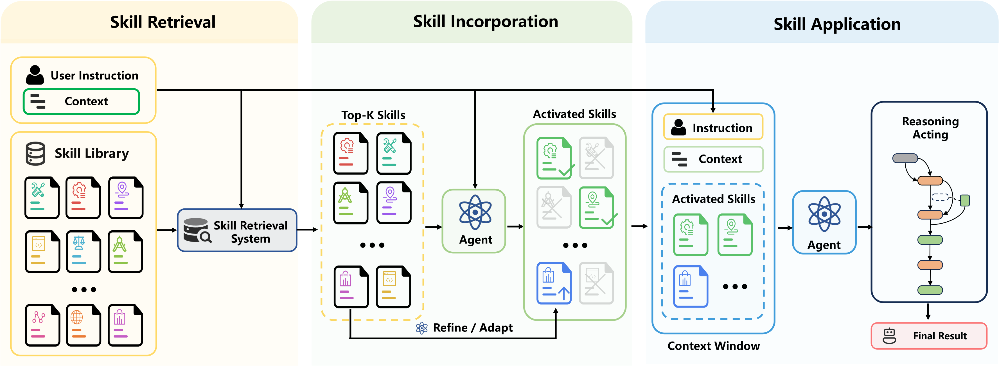

<h1 align="center">
  Skill Retrieval Augmentation for Agentic AI
</h1>

<h2 align="center">
  RAG retrieves knowledge. SRA retrieves capabilities.
</h2>

<p align="center">
  <a href="https://arxiv.org/abs/2604.24594">
    
  </a>
  <a href="https://huggingface.co/datasets/WeihangSu/SRA-Bench">
    
  </a>
  <a href="https://github.com/oneal2000/SR-Agents/stargazers">
    
  </a>
  <a href="https://github.com/oneal2000/SR-Agents/blob/main/LICENSE">
    
  </a>
</p>

<p align="center">
  <b>A community resource for studying and evaluating Skill Retrieval Augmentation (SRA).</b><br><br>
  This repository releases SRA-Bench and SR-Agents, providing data, baselines, and evaluation pipelines for research on retrieval-based skill augmentation in LLM agents.<br><br>
  ⭐ If you find this resource useful, we would be truly grateful if you could star this repo and cite our paper~
</p>


---

## 🔥 Why Skill Retrieval Augmentation?

Modern LLM agents are no longer just text generators. They increasingly rely on external **skills**: reusable capability packages that may include natural-language instructions, tool-use procedures, executable code, and auxiliary resources.

However, the dominant way to use skills today is still simple but unscalable: put available skills into the prompt and ask the model to choose. As skill libraries grow, this approach quickly runs into context-window limits and selection failures.

**Skill Retrieval Augmentation (SRA)** treats skills as a large external capability corpus. Instead of showing all skills in context, an agent must:

1. **Retrieve** relevant skills from a large skill library;
2. **Incorporate** the useful skills into its active problem-solving state;
3. **Apply** the skills correctly to improve downstream task performance.

This makes SRA a capability-centric counterpart to RAG:  
RAG retrieves knowledge; **SRA retrieves executable capabilities**.




---

## 🚀 What is included?

This repository releases the code and data for **Skill Retrieval Augmentation for Agentic AI**.

### SRA-Bench

The first benchmark for decomposed evaluation of Skill Retrieval Augmentation:

- **5,400** capability-intensive test instances;
- **636** manually constructed gold skills;
- **26,262** total skills in the retrieval corpus;
- Gold skills mixed with **25,626** web-collected distractor skills;
- Six task families: TheoremQA, LogicBench, ToolQA, MedCalc-Bench, CHAMP, and BigCodeBench;
- Evaluation of the full SRA pipeline: skill retrieval, skill incorporation, and end-task execution.

| Dataset | Capability Type | #Inst. | #Skills | Skill Mapping | Evaluation |
|---|---|---:|---:|---|---|
| TheoremQA | Theorem Application | 747 | 320 | Single | Rule-Based |
| LogicBench | Logical Reasoning Patterns | 760 | 19 | Single | Rule-Based |
| ToolQA | Tool-Use Workflows | 1,430 | 14 | Single | Rule-Based |
| MedCalc-Bench | Medical Calculators | 1,100 | 55 | Single | Rule-Based |
| CHAMP | Mathematical Concepts | 223 | 89 | Multi | Rule-Based |
| BigCodeBench | Software Libraries | 1,140 | 139 | Multi | Execution |

### SR-Agents

A research toolkit and baseline family for building and evaluating skill-retrieval-augmented agents:

- Skill retrieval with BM25, TF-IDF, BGE, Contriever, Hybrid retrieval, and BM25 + LLM reranking;
- Skill-use methods including LLM Direct, Oracle Skill, Full-Skill Injection, LLM Selection, and Progressive Disclosure;
- End-to-end CLI pipeline: `retrieve → infer → evaluate`;
- Support for OpenAI-compatible endpoints, including hosted APIs, vLLM, SGLang, Ollama, and local model servers.

---

## ⭐ Star and cite

If you find **SRA-Bench** useful, or if any findings in our paper help your research, we would be truly grateful if you could:

⭐ star this repository to help more researchers discover this resource;  
📌 cite our paper in your work.

Your support really means a lot to us!

```bibtex
@article{su2026skill,
  title={Skill Retrieval Augmentation for Agentic AI},
  author={Su, Weihang and Long, Jianming and Ai, Qingyao and Tang, Yichen and Wang, Changyue and Tu, Yiteng and Liu, Yiqun},
  journal={arXiv preprint arXiv:2604.24594},
  year={2026}
}
```


## Install

Requires Python 3.10 – 3.12.

```bash
pip install -e .       # or: uv sync
```

SRA-Bench ships with this repository under `data/bench/`. After
cloning, unzip the skill corpus once:

```bash
unzip data/bench/corpus/corpus.json.zip -d data/bench/corpus/
```

The same data is also published on
[HuggingFace](https://huggingface.co/datasets/WeihangSu/SRA-Bench) —
use either source, the contents are identical:

```bash
huggingface-cli download WeihangSu/SRA-Bench --repo-type dataset \
    --local-dir data/bench
```

<details><summary>ToolQA external corpus (only needed to run ToolQA)</summary>

Download from the
[ToolQA Google Drive link](https://drive.google.com/file/d/1zRbHzPW2x4dDcfmphBWlan8cxUCRNmqk/view?usp=drive_link),
unzip, and place the result under `data/external/toolqa/`.
</details>

Inference requires an OpenAI-compatible chat endpoint. Point
`--api-base` at any compatible server (OpenAI, vLLM, SGLang, Ollama, …).
`--model` is the served model identifier — a model ID like
`gpt-4o-mini` for hosted APIs, or whatever string the local server is
serving (often a path like `/models/Qwen3-32B`) for vLLM/SGLang. For
endpoints that require auth, set `OPENAI_API_KEY`; local unauthenticated
servers accept any value.

## Quickstart

An end-to-end run of the three stages on TheoremQA using Full-Skill
Injection with the BM25 top-1 skill:

```bash
# Pick one (examples; any OpenAI-compatible endpoint works).
# Hosted:  MODEL=gpt-4o-mini           API_BASE=https://api.openai.com/v1
# Local :  MODEL=/models/Qwen3-32B     API_BASE=http://localhost:8000/v1
MODEL=<MODEL>
API_BASE=<API_BASE>

# 1. Retrieve — BM25 top-50 per query.
sragents retrieve --retriever bm25 \
    --corpus data/bench/corpus/corpus.json \
    --instances data/bench/instances/theoremqa.json \
    --output results/retrieval/theoremqa-bm25.json

# 2. Infer — prepend the top-1 BM25 skill and generate an answer.
sragents infer \
    --instances data/bench/instances/theoremqa.json \
    --output results/inference/theoremqa-bm25_top1.jsonl \
    --model $MODEL --api-base $API_BASE \
    --provider topk \
      --provider-arg source=results/retrieval/theoremqa-bm25.json \
      --provider-arg k=1 \
    --engine direct --label bm25_top1

# 3. Evaluate — extract + score against ground truth.
sragents evaluate \
    --input results/inference/theoremqa-bm25_top1.jsonl \
    --instances data/bench/instances/theoremqa.json \
    --output results/eval/theoremqa-bm25_top1.json
```

The evaluator prints overall accuracy and saves a JSON of the form

```json
{
  "dataset": "theoremqa", "method": "bm25_top1", "model": "...",
  "metrics": {"accuracy": 0.XX, "correct": N, "total": 747},
  "details": [{"instance_id": "...", "extracted_answer": "...",
               "correct": true, "ground_truth": "...", ...}]
}
```

## Pipeline

The toolkit is organised as three CLI stages that pass JSON files
between them:

```
sragents retrieve  ─▶ retrieval/*.json   ranked skills + Recall@K, nDCG@K
sragents infer     ─▶ inference/*.jsonl  raw model output per instance
sragents evaluate  ─▶ eval/*.json        end-task accuracy
```

Each stage's output is consumed by the next via an explicit path
argument, so any stage can be swapped or rerun in isolation, and
every stage supports per-instance resume.

`infer` is parameterised by two orthogonal axes:

* **SkillProvider** — which candidate skills the instance receives:
  none, oracle (gold), top-K retrieval, LLM-selected, or oracle plus
  hard-negative distractors. The pool may already be narrowed to a
  single skill, or left wide for the engine to narrow further.
* **InferenceEngine** — how those candidates are turned into an
  answer. `direct` statically prepends everything it receives;
  agentic engines (`progressive_disclosure`, `react`,
  `react_progressive_disclosure`) interleave further skill selection
  with solving inside their reasoning loop.

The five skill-use methods studied in our experiments are specific
(Provider, Engine) combinations:

| Method | Provider | Engine | Description |
|---|---|---|---|
| **LLM Direct** | `none` | `direct` | No external skill — parametric-only baseline |
| **Oracle Skill** | `oracle` | `direct` | Annotated gold skill prepended (upper bound) |
| **Full-Skill Injection** | `topk(k=1)` | `direct` | Full content of the BM25 rank-1 skill prepended to the prompt |
| **LLM Selection** | `llm_select(pool=50)` | `direct` | Model picks one skill from BM25 top-50, then answers |
| **Progressive Disclosure** | `topk(k=50)` | `progressive_disclosure` | Model sees a compact skill catalog and loads skills on demand |

For ToolQA the `direct` engine is replaced by `react` and
`progressive_disclosure` by `react_progressive_disclosure`; the
experiment runner selects the right engine per dataset.

## CLI

A single `sragents` command is installed (also invokable as
`python -m sragents.cli.main`). Every subcommand has `--help`.

```bash
sragents list retrievers     # bm25 tfidf bge contriever
sragents list providers      # none oracle topk llm_select oracle_distractor
sragents list engines        # direct progressive_disclosure react react_progressive_disclosure
sragents list datasets       # theoremqa logicbench toolqa champ medcalcbench bigcodebench
sragents list experiments    # main, retrieval_comparison, topk_sweep, distractor, ...
```

### 1. Retrieve

```bash
sragents retrieve \
    --retriever bm25 \
    --corpus data/bench/corpus/corpus.json \
    --instances data/bench/instances/theoremqa.json \
    --output results/retrieval/theoremqa-bm25.json \
    --top-k 50
```

Dense retrievers default to the same checkpoints used in our
experiments — `BAAI/bge-base-en-v1.5` for `bge` and
`facebook/contriever-msmarco` for `contriever`. Override with
`--retriever-arg model_path=<hf-name>` to swap in a different model.

Retrievers can also be cascaded. `sragents rerank` is a second-stage
retriever: it reads an existing retrieval file, uses an LLM to reorder
the top-K candidates per query, and writes a new retrieval file in the
same format. A typical cascade is BM25 → LLM rerank:

```bash
sragents rerank \
    --input results/retrieval/theoremqa-bm25.json \
    --output results/retrieval/theoremqa-rerank_bm25.json \
    --instances data/bench/instances/theoremqa.json \
    --model <MODEL> --api-base <API_BASE> \
    --top-k 50
```

`sragents hybrid` is the round-robin fuser used for our Hybrid
(BM25 + BGE) retriever — see the reproduction recipe below.

### 2. Infer

```bash
sragents infer \
    --instances data/bench/instances/theoremqa.json \
    --output results/inference/theoremqa-Qwen3-32B-bm25_top1.jsonl \
    --model <MODEL> --api-base <API_BASE> \
    --provider topk \
      --provider-arg source=results/retrieval/theoremqa-bm25.json \
      --provider-arg k=1 \
    --engine direct \
    --label bm25_top1
```

Common recipes:

| Method | CLI fragment |
|---|---|
| LLM Direct | `--provider none --engine direct` |
| Oracle Skill | `--provider oracle --engine direct` |
| Full-Skill Injection | `--provider topk --provider-arg source=… --provider-arg k=1 --engine direct` |
| LLM Selection | `--provider llm_select --provider-arg source=… --provider-arg pool=50 --engine direct` |
| Progressive Disclosure | `--provider topk --provider-arg source=… --provider-arg k=50 --engine progressive_disclosure` |
| ToolQA | For any of the above, use `--engine react` in place of `direct`, or `--engine react_progressive_disclosure` in place of `progressive_disclosure` |

### 3. Evaluate

```bash
sragents evaluate \
    --input results/inference/theoremqa-Qwen3-32B-bm25_top1.jsonl \
    --instances data/bench/instances/theoremqa.json \
    --output results/eval/theoremqa-Qwen3-32B-bm25_top1.json
```

## Reproducing our experiments

The retrievers used across all experiments are BM25, TF-IDF, BGE,
Contriever, a round-robin hybrid of BM25 and BGE, and an LLM rerank
of BM25's top-50. Pre-compute the first-stage retrievers, then fuse
BM25 + BGE into the hybrid file:

```bash
DATASETS="theoremqa logicbench toolqa champ medcalcbench bigcodebench"

# First-stage retrievers.
for ds in $DATASETS; do
    for r in bm25 tfidf bge contriever; do
        sragents retrieve --retriever $r \
            --corpus data/bench/corpus/corpus.json \
            --instances data/bench/instances/$ds.json \
            --output results/retrieval/$ds-$r.json
    done
done

# Round-robin fusion of BM25 + BGE.
for ds in $DATASETS; do
    sragents hybrid \
        --input results/retrieval/$ds-bm25.json \
                results/retrieval/$ds-bge.json \
        --output results/retrieval/$ds-hybrid_bm25_bge.json
done
```

The LLM rerank output is model-dependent (file name:
`*-rerank_bm25-<model>.json`), so it has to be produced once per
evaluated model:

```bash
MODEL=<MODEL>          # same identifier you pass to `sragents infer --model`
API_BASE=<API_BASE>
for ds in $DATASETS; do
    sragents rerank \
        --input  results/retrieval/$ds-bm25.json \
        --output results/retrieval/$ds-rerank_bm25-$(basename $MODEL).json \
        --instances data/bench/instances/$ds.json \
        --model $MODEL --api-base $API_BASE --top-k 50
done
```

`sragents experiment --exp retrieval_comparison` triggers
`sragents rerank` on demand if the rerank file is missing.

Skill-retrieval metrics (Recall@K, nDCG@K) are computed by
`sragents retrieve` and `sragents rerank` directly into their
output JSONs, so no separate end-to-end run is needed to obtain
them. The end-to-end experiment runners produce inference traces
and end-task accuracy:

```bash
# Main results: 5 skill-use methods × 6 datasets.
sragents experiment --exp main \
    --model <MODEL> --api-base <API_BASE>

# Retriever comparison: rank-1 end-to-end under BM25, TF-IDF, BGE,
# Contriever, and BM25 + Rerank. The rank-1 Hybrid is omitted — its
# round-robin fusion always returns BM25's top-1 at rank 1, so its
# end-to-end numbers are identical to BM25.
sragents experiment --exp retrieval_comparison \
    --model <MODEL> --api-base <API_BASE>

# Noise robustness: gold skill plus N ∈ {0, 2, 4, 8} hard-negative
# distractors, drawn by alternately picking non-gold candidates from
# BM25 and BGE rank lists (both retrieval files must already exist).
# Run under Full Skill Injection and Progressive Disclosure exposure.
sragents experiment --exp distractor \
    --model <MODEL> --api-base <API_BASE>
```

The skill-loading-rate analyses in our paper are derived from the
inference traces left behind by `--exp main` rather than from a
separate run.

The catalog also includes `--exp topk_sweep`, an additional
ablation that varies BM25 top-K (K ∈ {1, 2, 4, 8}) under both
exposure modes. Use `--exp topk_sweep_injection` or
`--exp topk_sweep_progressive_disclosure` to restrict to a single
mode.

Narrow the scope of any experiment with `--dataset theoremqa
logicbench` or `--methods bm25_top1 progressive_disclosure` (use
the technical method labels, not the human-readable display names).
The runner invokes `sragents infer` and `sragents evaluate` for
each (dataset, method) cell and skips cells whose output files
already exist.

## Project layout

```
src/sragents/
├── config.py               # path constants, ALL_DATASETS
├── corpus.py               # skill corpus loading
├── llm.py                  # OpenAI-compatible client
├── prompts.py              # per-dataset prompt builders
│
├── retrieve/               # Stage 1
│   ├── base.py             #   Retriever protocol + registry
│   ├── bm25.py · tfidf.py · dense.py · hybrid.py · llm_rerank.py
│   └── metrics.py · schema.py
│
├── infer/                  # Stage 2
│   ├── base.py             #   SkillProvider + InferenceEngine protocols
│   ├── runner.py           #   per-instance parallel execution + resume
│   ├── providers/          #   none · oracle · topk · llm_select · oracle_distractor
│   └── engines/            #   direct · progressive_disclosure · react · react_progressive_disclosure
│
├── evaluate/               # Stage 3
│   ├── base.py             #   Evaluator protocol + registry
│   ├── datasets/           #   6 per-dataset evaluators
│   └── metrics.py
│
├── toolqa/                 # ToolQA tools (used by ReAct engines)
├── experiments/            # experiment catalog + runner
└── cli/                    # sragents <subcommand> entry points

data/bench/
├── corpus/corpus.json      # 26,262 skills (636 gold + 25,626 web)
└── instances/*.json        # 6 datasets
```

## License

See [LICENSE](LICENSE).

## ⭐ Star and cite

If you find **SRA-Bench** useful, or if any findings in our paper help your research, we would be truly grateful if you could:

⭐ star this repository to help more researchers discover this resource;  
📌 cite our paper in your work.

Your support really means a lot to us!

```bibtex
@article{su2026skill,
  title={Skill Retrieval Augmentation for Agentic AI},
  author={Su, Weihang and Long, Jianming and Ai, Qingyao and Tang, Yichen and Wang, Changyue and Tu, Yiteng and Liu, Yiqun},
  journal={arXiv preprint arXiv:2604.24594},
  year={2026}
}
```

